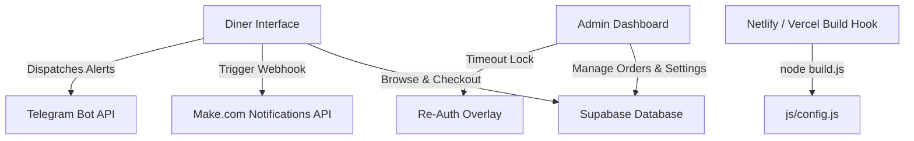

# 🍛 Bengali Hotel Restaurant Ordering System

A high-fidelity, responsive online ordering and restaurant administration platform designed for **Bengali Hotel** (New Delhi). This system provides customers with a seamless menu browsing and checkout experience, and restaurant owners with a powerful analytics dashboard, security logging, and real-time multi-channel notification systems.
---
## Live Demo

Customer Portal:
https://bengalihotel.netlify.app

Admin Dashboard:
https://bengalihotel.netlify.app/dashboard

---

## 🌟 Key Features

### 1. Customer Ordering & Checkout Experience
* **Dynamic Menu & Cart Management**: Clients can browse structured food categories (Veg/Non-Veg Thalis, Main Courses, Bread, Paratha Combos) with real-time price updates and quantity controls.
* **Premium Packaging Selection**: Dynamic checkout fee updates (+₹100) integrated into order logging.
* **Client-Side Invoice Compiler**: Dynamically generates and compiles custom receipt PDFs utilizing `jsPDF` for instant download.

### 2. Multi-Channel Notifications & Webhooks
* **Telegram Bot Integration**: Formatted HTML notification alerts dispatched directly to the chef/owner's Telegram Chat ID on new checkouts and status transitions.
* **Make.com Webhooks**: Integrates with external automated APIs for sending automated customer email confirmations and WhatsApp updates.
* **Dynamic Database Decoupling**: API keys and webhooks are retrieved securely at runtime from the database rather than hardcoded in source control.

### 3. State-of-the-Art Owner Dashboard
* **Real-time Analytics**: Tracks daily, weekly, and monthly revenue statistics alongside recent activity list widgets.
* **Interactive Charting**: Custom Chart.js dashboard integration showing historical sales trends.
* **Order Lifecycle Management**: Quick action status selectors for updating orders (Pending, Processing, Delivered, Cancelled) with automatic webhook triggers.

### 4. Advanced Security & Access Control
* **Zero Hardcoded Secrets**: Client configuration (`js/config.js`) is dynamically built during deployment via a custom pre-build Node hook (`build.js`) from secure environment variables.
* **OTP-Based Forgot Password Flow**: Secure admin recovery modal using 10-minute database-validated 6-digit OTP logs.
* **Inactivity Re-Authentication Timeout Modal**: Full-screen modal that locks the dashboard interface upon session inactivity, allowing admins to re-authenticate and resume active states without losing progress.

---

## 🛠️ Architecture & Tech Stack




### Frontend
* **Core**: Vanilla HTML5, CSS3 (Custom Heritage Luxe Theme), JavaScript (ES6+).
* **Charts & Metrics**: Chart.js.
* **Invoice Generation**: jsPDF.
* **Routing**: Netlify Redirects / Vercel SPA Rewrites.

### Backend & Database
* **Database**: PostgreSQL (Supabase).
* **API SDK**: Compiled Supabase JS Client.
* **Webhooks & Automation**: Make.com.

---

## 🗄️ Database Schema (PostgreSQL)

The application communicates with a PostgreSQL instance consisting of the following key tables:

```sql
-- Customers Table
CREATE TABLE customers (
    id UUID PRIMARY KEY DEFAULT gen_random_uuid(),
    name VARCHAR(255) NOT NULL,
    mobile VARCHAR(10) UNIQUE NOT NULL,
    created_at TIMESTAMP WITH TIME ZONE DEFAULT timezone('utc'::text, now()) NOT NULL
);

-- Orders Table
CREATE TABLE orders (
    id UUID PRIMARY KEY DEFAULT gen_random_uuid(),
    customer_name VARCHAR(255),
    customer_mobile VARCHAR(10),
    order_items JSONB NOT NULL,
    total_amount NUMERIC NOT NULL,
    packaging BOOLEAN DEFAULT false,
    order_status VARCHAR(50) DEFAULT 'Pending',
    receiver_name VARCHAR(255),
    receiver_mobile VARCHAR(10),
    pincode VARCHAR(6),
    flat_number TEXT,
    street TEXT,
    area TEXT,
    city TEXT,
    state TEXT,
    landmark TEXT,
    full_address TEXT,
    created_at TIMESTAMP WITH TIME ZONE DEFAULT timezone('utc'::text, now()) NOT NULL
);

-- Admins Table
CREATE TABLE admins (
    id UUID PRIMARY KEY DEFAULT gen_random_uuid(),
    username VARCHAR(255) UNIQUE NOT NULL,
    password VARCHAR(255) NOT NULL,
    email VARCHAR(255) NOT NULL,
    created_at TIMESTAMP WITH TIME ZONE DEFAULT timezone('utc'::text, now()) NOT NULL
);

-- OTP Logs Table (Password Recovery)
CREATE TABLE otp_logs (
    id UUID PRIMARY KEY DEFAULT gen_random_uuid(),
    admin_id UUID REFERENCES admins(id) ON DELETE CASCADE,
    otp_code VARCHAR(6) NOT NULL,
    expires_at TIMESTAMP WITH TIME ZONE NOT NULL,
    verified BOOLEAN DEFAULT false,
    created_at TIMESTAMP WITH TIME ZONE DEFAULT timezone('utc'::text, now()) NOT NULL
);

-- Notification Settings Table
CREATE TABLE notification_settings (
    id INT PRIMARY KEY DEFAULT 1,
    make_webhook_url TEXT,
    owner_email VARCHAR(255),
    owner_whatsapp VARCHAR(20),
    telegram_bot_token TEXT,
    telegram_chat_id TEXT,
    updated_at TIMESTAMP WITH TIME ZONE DEFAULT timezone('utc'::text, now()) NOT NULL
);
```

---

## ⚙️ Development & Deployment Setup

### Local Setup
1. Clone the repository:
   ```bash
   git clone https://github.com/CaptainShyamal/Bengali-Hotel-Delivery-System.git
   ```
2. Create a `.env` file in the root directory and add your Supabase credentials:
   ```env
   SUPABASE_URL=https://your-project.supabase.co
   SUPABASE_KEY=your-anon-public-api-key
   ```
3. Generate the client configuration file:
   ```bash
   node build.js
   ```
4. Start a local server:
   ```bash
   python -m http.server 8080
   ```
5. Open `http://localhost:8080` in your browser.

### Production Deployment (Netlify & Vercel)
The project includes pre-configured config mapping hooks. When importing to your hosting provider, specify:
* **Build Command**: `npm run build` (runs `node build.js` to dynamically create `js/config.js` from deployment environment settings).
* **Publish Directory**: `.`
* **Environment Variables**: Add `SUPABASE_URL` and `SUPABASE_KEY` under the build configuration settings.
* **Routing**: Handles route rewrites natively via `netlify.toml` and `vercel.json`.

---

## 🔒 Security Best Practices Implemented
* **Secrets Segregation**: Configuration tokens and credentials are kept out of version control and managed via build pipelines.
* **Data Sanitization**: Standardized input validations for name inputs, pincodes, and 10-digit mobile parameters on the client-side.
* **Database RLS Enforcements**: Ensures database actions match authorized user session scopes.

---
## Developed By

Shyamal Jana

- B.Tech CSE, VIT-AP University
- Java | Python | Web Development
- GitHub: https://github.com/CaptainShyamal
- LinkedIn: https://www.linkedin.com/in/shyamal-jana
